## What's a "Life Stack"?
This is my "Life Stack". I used to call it "Stuff I Use" but "Life Stack" sounds
cooler. Either way, it's a list of things that I use to manage my life or that I
simply enjoy using.

Last updated **September 2020**

## Computing
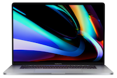
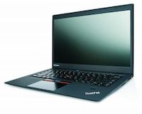
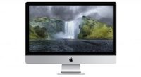

- Apple MacBook Pro 16-inch (2019) – Finally, Apple makes a good laptop again.
- Lenovo ThinkPad X1 Carbon (2015) – New to me. Running Linux. So far so good, except for the trackpad.
- Apple 27" Retina iMac (2017) – A monster with a big, beautiful screen.
- Apple iPad Pro 12.9" (2018) – I am not an iPad-only person. Not sure I ever will be but this is a great device anyway. The Apple Pencil #2 and the way it integrates with the new iPad is terrific.
- iPhone X – It's an iPhone. A really nice one. I put it in the Computing category but it goes in nearly every category.
- Fujitsu ScanSnap – Super-fast and easy document scanning

## Software (Work, writing, and "productivity" tools)

Here's the software that I currently use on a regular basis.

- [Roam](https://roamresearch.com) -- The hype is real
- [Emacs](https://www.gnu.org/software/emacs/) -- "An extensible, customizable, free/libre text editor — and more."
- [Org mode](https://orgmode.org/) -- Tasks, lists, documents, publishing, all in plain text.
- [DEVONthink][devonthink] – Email Archives, Manuals, PDFs, Scanned documents. Years of
  archives remain searchable and synced across devices.
- [BBEdit][bbedit] – As much as I try to remain in Emacs for editing, whenever I need
  something fancy done with a lot of text, I turn to BBEdit. It’s the editor
  I’ve used longest. In fact, it may be the piece of software I’ve used longest,
  period. It remains truly great.
- [Vim][vim] – I’ve used VIM for as long as I can remember. For a number of years it
  was my only editor, but today I use it mostly for quick local edits or for
  editing files on servers.
- [LaTeX][latex] – I have no real need for LaTeX but it does such a great job
  laying out documents that I use it anyway. Mostly, this is done via Org mode
  but I also use LaTeX directly when I feel like being tweaky.
- [iTerm2][iterm2] – I spend a lot of time in a terminal, and I use iTerm2 for that.
- [Slack][slack] – People enjoy hating on Slack but it really is a wonderful replacement
  for the tangle of emails and reply-all threads that came before.
- [Gitlab][gitlab] – We use a self-hosted instance of Gitlab at Fusionary and it’s
  transforming how we work. Issues, code, CI, and documentation all in one place
  is pretty great.
- [Git][git] – For a long time I pushed Mercurial over Git, as it was simpler to
  use and understand. I lost, so Git is where it’s at. Git has gotten much
  easier to deal with in the past couple of years.
- [Dropbox][dropbox] – Steve Jobs famously called Dropbox “a feature, not a product”. True
  or not, Dropbox is a pretty damn good feature. I still don’t trust iCloud. I
  trust Dropbox.
- [1Password][passwords] -- Password management
- [Chronosync][chronosync] – Helps me keep good drive and file backups
- [Alfred][alfred] -- Launcher and generally useful utility for all sorts of automation and shortcuts
- [Keyboard Maestro][keyboardmaestro] – Macro wizardry. I wildly useful tool for
  automating things. I've also started using it as my text snippet expander and
  it works great for that, too.
- [Tinderbox][tinderbox] -- "The Tool For Notes" indeed. And so much more.

## Photography
### Software
- [Lightroom](https://www.adobe.com/products/photoshop-lightroom.html) -- I hate
  the idea of keeping my library in the cloud, but love having everything
  available everywhere all the time. I use the Classic version mostly.
- [Capture One Pro][captureone] – Photo library and Raw file editor.
- Apple Photos - For iPhone shots and keepers exported from Capture One
- [Photo Mechanic][photomechanic] – Ingesting, tagging, renaming photos from
  cards. Nothing is faster or easier. I’d like to not need it, but trying to
  caption and tag dozens of photos at a time is an exercise in frustration in
  any other app.
- [SilverFast][silverfast] – Scanning software for the Epson. I can’t tell you
  how much I hate it, but it gets me the best results.
- [Luminar][luminar] - I use Luminar as an editor plugin for Lightroom. Some of
  the filters are too much fun to resist.
- [Affinity Photo](https://affinity.serif.com/en-gb/photo/) - Great for when I need to get "fancy". I don't enjoy Photoshop and this is a wonderful alternative.

### Cameras
I love cameras. Most of mine are old film cameras. Here’s what I’m using currently.

**Leica M10-P**

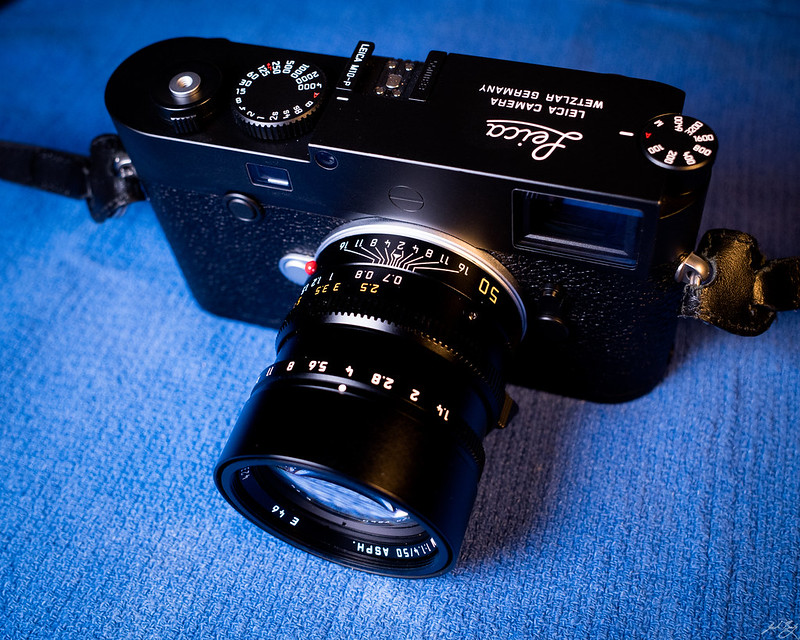

The Leica M10-P has been a dream camera. Paired with the fabulous 50mm Summilux-M ASPH I am wanting of nothing.

**Hasselblad 500C/M and 503CXi**

Medium format film cameras. Some cameras are iconic for a reason. The Hasselblad
V series are iconic, beautiful, and superbly engineered. They also produce
wonderful images, which is why they are my favorite all-around cameras.

**Leica M6**

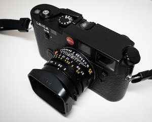

Even though I've tried to shelve 35mm film for a while, I can’t help but keep
the M6 nearby. Sometimes I pick it up just to feel it in my hands. Leicas really
are special cameras. They don't really help me make better images, but they
still make me feel like I could.

**Fujifilm X-T3**

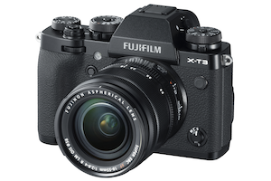

Great all-around digital camera. I've mostly moved off Fuji but I keep this one for when I need something fast and with autofocus. Also, it's great for video.

**Graflex Crown Graphic**

Large Format Film Camera. This camera is a total pain in the ass to use, but I
love it so. There’s nothing like a 4×5 negative.

Polaroid SX–70 and OneStep2

**Other Cameras**

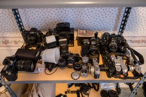

Like I said, I love cameras. Here's a list of the ones I currently own but don't use as often.

- **Burke & James Press Camera** – 4×5 film camera
- **Canon 1Ds** – Digital SLR camera. Getting old, but what a beast it was in its day.
- **Canon AE–1 Program** – 35mm Film SLR (My first real camera)
- **Canon Canonet** – 35mm rangefinder camera
- **Canon EOS–1v** – Damn good 35mm film SLR
- **Canon Pro-zoom 814 Electronic** – Super8 movie film camera
- **Fujifilm X100** – Go-everywhere digital
- **Fujifilm X100T** – Go-everywhere digital, updated
- **Graflex Speed Graphic** – Large Format (4×5) Film Camera
- **Leica IIIf** – Barnack!
- **Leica M3** – Rangefinder camera
- **Leica M4** – Rangefinder camera
- **Minolta Autocord** – Medium format TLR
- **Nikon F100** – 35mm auto-focus film camera
- **Nikon F3HP** – 35mm manual-focus film camera. Wonderful!
- **Olympus OM–1n** – 35mm film camera
- **Olympus OM–2n** – 35mm film camera
- **Olympus Stylus Epic** – Compact 35mm film camera

### Photo Hardware

Some miscellaneous photo-related support items

- **Canon PRO–100** – Photo printer that I never use
- **Epson V750** – Flatbed film scanner. Works great for medium and large format. Less great for 35mm.
- [Pakon Scanner][pakon] – For 35mm film scanning. Makes shooting color 35mm film
  worthwhile. Requires an old Windows computer running Windows XP, which sucks.
- [Profoto D1 Monolights][profoto] – I’m fortunate enough to own a couple great monolights.
  I should totally use them more often.

[pakon]: /2015/the-kodak-pakon-f-135-plus-scanner-2/
[profoto]: https://www.bhphotovideo.com/c/product/661871-REG/Profoto_901056_D1_Air_500Ws_2_Monolight.html
 
### Darkroom

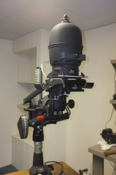

I haven't had a darkroom since my recent move, but here's what's in storage for when I make room.

- [Leitz Focomat v35][focomatv35] – 35mm auto-focus enlarger. Solid and reliable. It cost as much as a Volkswagon when it was first produced in 1979. It is an
amazing device.
- [Beseler 45MXT][beseler] – This is for printing medium and large format negatives. Mine is a little janky but works great overall.
- [Leitz Focomat IIc][focomatiic] – Manufactured from 1956–1983, the Focomat IIc is a giant, over-engineered marvel of an enlarger. I bought mine as a fixer-upper from Craigslist and I still don’t have it working completely. When I do, I may be able to get rid of the v35 and possibly the Beseler.

[focomatiic]: https://www.l-camera-forum.com/leica-wiki.en/index.php/Focomat_IIc
[beseler]: https://www.bhphotovideo.com/c/product/3991-REG/Beseler_8227_45MXT_Enlarger_Chassis_Only.html
[focomatv35]: http://www.bonavolta.ch/hobby/en/photo/v35.htm

## Lifestyle and Miscellaneous Hardware

### Music

- [Rega P1 Turntable][regap1] – I love listening to records. I love owning my
music and being able to see as well as hear it. I consider the P1 to be a
terrific value. Audio people call it a “budget” turntable but I prefer to think
of it as a cheap, “high-end” turntable. I’ve used it nearly every day for almost
a decade.
- [Thorens TD 160 Turntable][thorens] – Classic turntable that I’ve somewhat
restored. Sounds great but is a bit finicky.
- [Rega Brio 3 Integrated Amplifier][regabrio] – Purchased in 2010 to go with P1.
It has a good phono stage and still sounds great. I don’t feel a need to replace
it.
- [Roon Optimized Core Kit / NUC][rock] - This is my new favorite thing. It's a tiny computer running the [Roon music software][roon] and it's the best way I've ever had to listen to, organize, and discover music.

And the rest...

- **Focal Chorus V Speakers** – Pretty good floor-standing speakers in my living
  room.
- **Yamaha CD-S300BL CD Player** – I still listen to CDs, so I bought a new CD
  player a few years ago.
- **Sonos wireless music system** – Music everywhere in my house. I have a Play:5,
  several Play:3s, and an old and
- **Onkyo A-5VL** – Drives the Thorens turnable in my home office.
- **Grado SR–80e** – Best price/performance I’ve found in headphones. I prefer
  open-back headphones and these are great.
- **Apple AirPods** – The most Apple-like device Apple has released in a while. They
  work great. I use them primarily for when I’m walking or when making phone
  calls.
- **Apple HomePod** -- I ended up with a couple of these. I prefer the sound to the Sonos and don't really use the "smart" stuff at all. I stream from Roon.

[regap1]: https://www.amazon.com/REGA-Rega-RP1-Turntable-Gray/dp/B004B3GELG
[thorens]: http://allforturntables.com/2017/04/26/for-vintage-lovers-review-the-thorens-td-160-mki-mkii-super-one-of-the-best-thorens-turntables/
[regabrio]: https://www.stereophile.com/content/rega-brio-integrated-amplifier-rega-brio-3-march-2007
[rock]: https://kb.roonlabs.com/Roon_Optimized_Core_Kit
[roon]: https://roonlabs.com/

### Other

- **Amazon Kindle Oasis** (2nd gen) – Books on the go. I prefer real books but the
  Kindle sure is handy. I like the larger size of this model.
- **Kobe Forma** ebook reader -- An alternative to Amazon that works great with more formats
- **Amazon Echo** – I have several, but am using them less recently. I don't love
  using voice-controlled devices.
  
## Pen and Paper

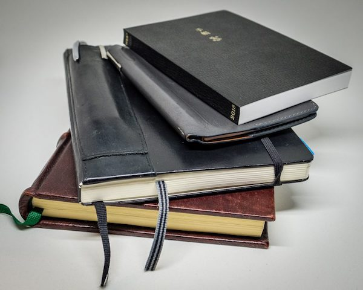

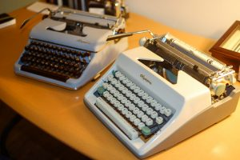

- [Leuchtturm 1917 Notebooks][leuchtturm] – Better than a Moleskine and perfect for use as a
  Bullet Journal.
- [Hobonichi Techo Planner][hobonichi] – Best little day planners ever. I’ve carried one for
  five or six years. I sometimes use them only sporadically, but I always come
  back.
- [Field Notes][fieldnotes] - Always have a Field Notes notebook in my back pocket. It's a way
  better capture tool than the iPhone
- Montblanc Meisterstück rollerball pen – My all-time favorite. I’ve had mine
  for 20 years. It’s broken in 2 places but I still use it.
- [Pelikan Souveran M400][pelikan] – Beautiful, classic fountain pen. I had the nib tweaked
  by Richard Binder and it writes like butter.
- [Mitsu-Bishi Hi-Uni Pencils][hiuni] – I've come around on pencils recently. I find
  myself reaching for a pencil as often as a pen. More so, maybe.
- [Caran D’ache Pencil Sharpening Machine][sharpener] – Overkill, but I love it.
- [Olympia SM3 Typewriter][sm3] – My favorite typewriter
- [Olympia SM9 Typewriter][sm9] – My second favorite typewriter

[leuchtturm]: https://www.amazon.com/Leuchtturm1917-Medium-Size-Hardcover-Notebook/dp/B002TSIMW4/
[hobonichi]: https://www.1101.com/store/techo/en/2018/pc/detail_cover/pb18_jan.html
[pelikan]: https://www.amazon.com/Pelikan-Souveran-M400-Black-Fountain/dp/B002MT02DM/
[hiuni]: https://www.jetpens.com/Uni-Mitsubishi-Hi-Uni-Pencils/ct/621
[sharpener]: https://www.amazon.com/Caran-Dache-Pencil-sharpening-Machine-455-200/dp/B0013F5R0Y/
[sm3]: https://typewriterreview.com/2013/02/28/olympia-sm3/
[sm9]: /2014/olympia-sm9/
[fieldnotes]: https://fieldnotesbrand.com/

## Every Day Carry

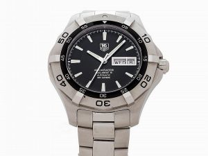
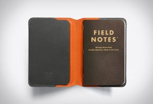

- [Tag Heuer Aquaracer Automatic watch][tag] – No batteries, beautiful, and good to 300
  meters in the water – because that’s handy right?
- **Apple Watch (Series 5)** – The health stuff and proper notifications are handy
- [Goruck GR1 backpack][goruck] – If I ever go outside I’m ready
- [Benchmade Mini Griptilian AXIS Lock Knife][knife] – Always in my pocket. I never
  realized how handy a pocket knife could be until I started carrying one
  everywhere.
- [Bellroy Note Sleeve Wallet][wallet] – Feels great, works great.
- [Bellroy Field Notes Notebook Cover][bellroy] – A great way to carry my ever-present
  Field Notes notebook.
- [Blunt Classic Umbrella][blunt] – Who knew a good umbrella would make such a difference? This is a very nice one.
- [Filson original Briefcase][filson] – I’ve owned a number of bags and this one is the one I’ve settled on. Well-designed and very well-made.
- [ONA Prince Street][ona] – Camera bag. Leather. Gorgeous.
- [Red OXX CC Rider Messenger][redoxx] - A great bag from Red Oxx. It was a special edition and no longer available. Too bad.
- [Peak Design Everyday Messenger - 13"](https://www.peakdesign.com/collections/everyday-bags/products/everyday-messenger?variant=11607015194668) -- Camera and iPad to work and back.

Whew!

## Changelog

### Sunday, September 6, 2020
- Swapped in Leica M10-P for the Leica Q

### Saturday, February 08, 2020
- Added Red Oxx bag
- Removed TheBrain
- Removed older iMac
- Replaced 2016 MBP with 2019 16-inch MBP

### Friday, January 18, 2019
- Added Emacs back :)
- New bag

### Saturday, December 08, 2018
- Added new iPad 12.9"
- Added HomePods
- Replaced X-Pro2 with X-T3

### Thursday, October 04, 2018
- Added Leica Q
- Added Photos and Affinity Photo
- Deleted Emacs and friends :(

### Sunday, September 23, 2018
- Replaced Lightroom with Capture One

### Friday, July 13, 2018
- Removed 12.9" iPad Pro. I gave it to my dad.
- Restored 1Password to its rightful place. Remind me to never switch password managers.

### Friday, June 1, 2018
- Changed from 1Password to Dashlane for password management
- Replaced LaunchBar with Alfred
- Replaced Pass with YNAB
- Removed TextExpander since I'm now using [Keyboard Maestro][keyboardmaestro] for text snippet expansion

[tag]: https://www.tagheuer.com/en-us/watches/aquaracer-calibre-5-automatic-watch-43-mm-way2010-ba0927
[goruck]: https://www.goruck.com/GR1
[knife]: https://www.amazon.com/Benchmade-Mini-Griptilian-Knife-Drop-Point/dp/B06XKRZX76
[wallet]: https://bellroy.com/products/note-sleeve-wallet/leather/teal#image-0
[bellroy]: https://bellroy.com/products/field-notes-notebook-cover-mini/leather/charcoal#image-1
[blunt]: https://www.amazon.com/dp/B00M3E26F8/
[filson]: https://www.filson.com/original-briefcase-1.html
[ona]: https://www.amazon.com/ONA-Messenger-Antique-Leather-ONA5-024LBR/dp/B00N33F0SI/

[spacemacs]: https://spacemacs.org/
[orgmode]: https://orgmode.org/
[devonthink]: http://www.devontechnologies.com/products/devonthink/overview.html
[vim]: http://www.vim.org/
[latex]: https://www.latex-project.org/
[iterm2]: https://www.iterm2.com/
[bbedit]: https://www.barebones.com/products/bbedit/
[firefox]: https://www.mozilla.org/en-US/firefox/new/
[slack]: https://slack.com/
[gitlab]: https://about.gitlab.com/
[git]: https://git-scm.com/
[dropbox]: https://www.dropbox.com/
[dashlane]: https://www.dashlane.com/
[chronosync]: https://www.econtechnologies.com/chronosync/overview.html
[alfred]: https://www.alfredapp.com/
[keyboardmaestro]: https://www.keyboardmaestro.com/main/
[tinderbox]: http://www.eastgate.com/Tinderbox/
[thebrain]: http://www.thebrain.com/products/thebrain
[ynab]: https://www.youneedabudget.com/
[captureone]: https://www.phaseone.com/en/Products/Software/Capture-One-Pro/Highlights.aspx
[photomechanic]: http://www.camerabits.com/tour-v5/
[silverfast]: http://www.silverfast.com/
[luminar]: https://skylum.com/luminar
[alienskin]: https://www.alienskin.com/exposure/
[passwords]: https://1password.com
[things3]: https://culturedcode.com/things/
[redoxx]: https://redoxx.com/

