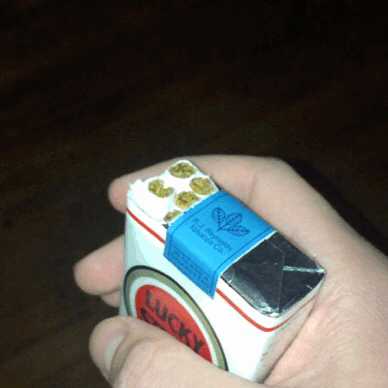
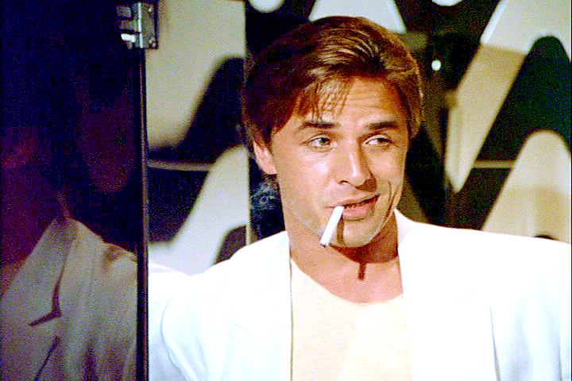

I was a smoker from 1983 until 1996. I loved smoking and I was good at it. I’ll probably start smoking again the minute lung transplants are an outpatient procedure.



It’s been so long since I smoked that I barely remember it. I hate to admit that what I do remember about smoking, I remember fondly. Except maybe the addiction part. It’s a wicked addiction. It took me at least a dozen serious attempts over several years to finally quit.

I failed many times at quitting. It would start with a night of chain smoking at a bar until all hours. I’d wake up hungover, cough a few times, and say, “That’s it, I quit!” I’d last a day or three and then something I didn’t like would happen in my life. Maybe a girl dumped me. Maybe it was a rough day digging ditches (I worked for a trenching company). Anyway, _something_ would happen and I’d sit in a gas station parking lot for 20 minutes before finally saying “Fuck it” and buying a pack.

A girlfriend around that time allowed herself to smoke only on weekends. I envied her ability to regulate it like that, but I couldn’t do it. For me it was two packs a day or nothing.

I started out smoking Camel Lights, but that changed because of Don Johnson. Miami Vice was popular that year, and I tried pulling off wearing what I called “Don Johnson outfits”. I mostly just looked stupid and I never heard the end of it from my friends.

While in Florida during spring break in 1985, I was wearing one of those infamous outfits when my friend Wayne went out for cigarettes. Instead of my regular Camel Lights, he came back with non-filtered Lucky Strikes. “You want to be Don Johnson so badly, here you go!”. (Johnson’s character smoked Lucky Strikes on the show.) I was drunk enough at the time so that the harsh draw of a non-filtered cigarette didn’t bother me. The next day I finished the pack, learned to love the harshness, and it was Lucky Strikes from then on.

In the 90s smoking started becoming less fun. Restaurants frowned on it until eventually they kicked us out for good. At one point I had a cubicle job in a confined office space and smoked all day right at my desk. How terrible that must have been for all the non-smokers. I still feel guilty about that. Once I started with Fusionary, I had to go outside to smoke. I’d become one of those people who stood shivering in the snow many times a day while “enjoying” a cigarette. Gross. I finally gave them up out of frustration.



The above photo of me and my ex-wife Robin may be the last record of me smoking. I plan on it staying that way

I joke about starting again, because I actually miss smoking. I really was good at it. I carried a Zippo and could do that flip-snap-light move with it. I loved the way I could use lighting a cigarette as a way to pause before answering a difficult or uncomfortable question. I loved coffee and cigarettes in the morning. And it’s true that smoking after sex is wonderful.

I’m old enough to have smoked on an airplane. My dad tells me that when I was born, they brought trays of cigarettes around to him in the hospital. In the hospital!

I miss smoking, but I hope I never do it again.

  

