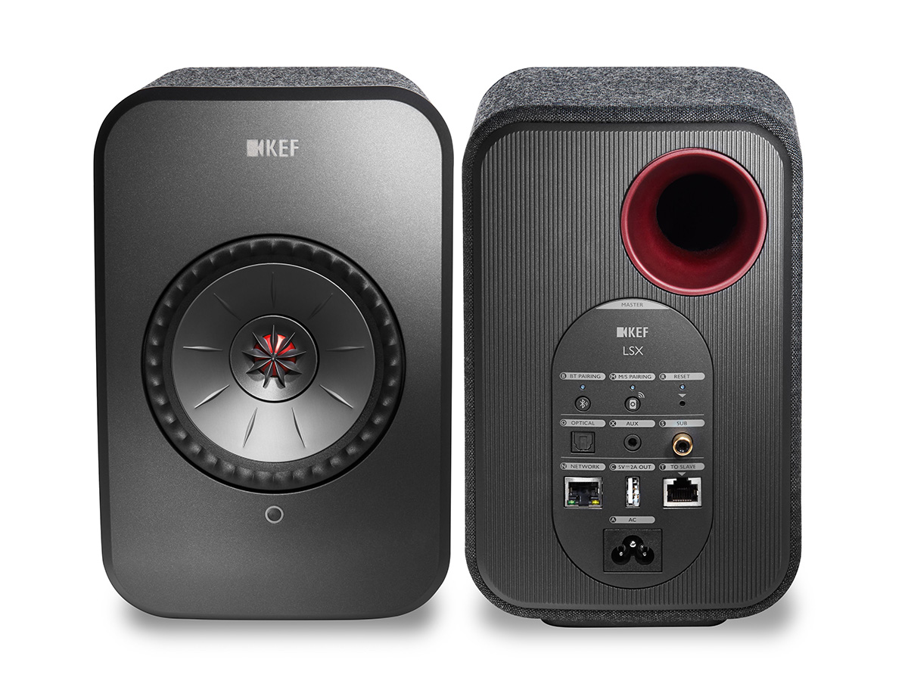
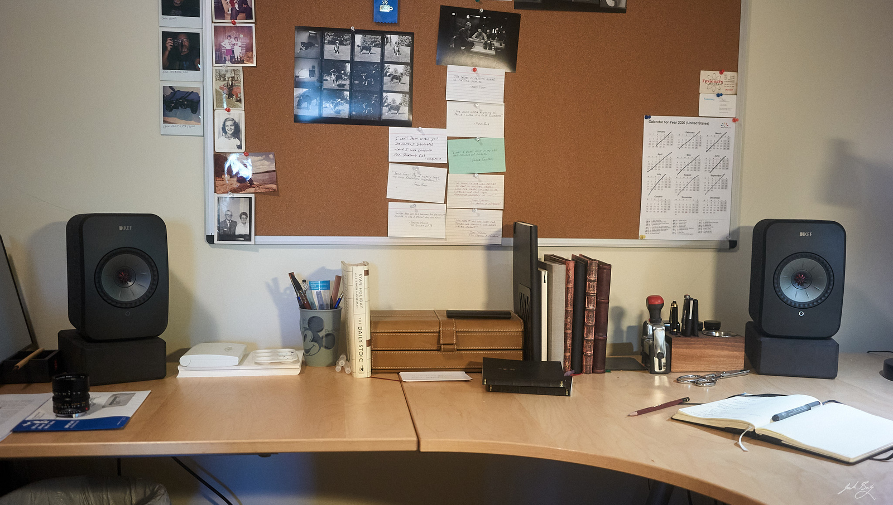
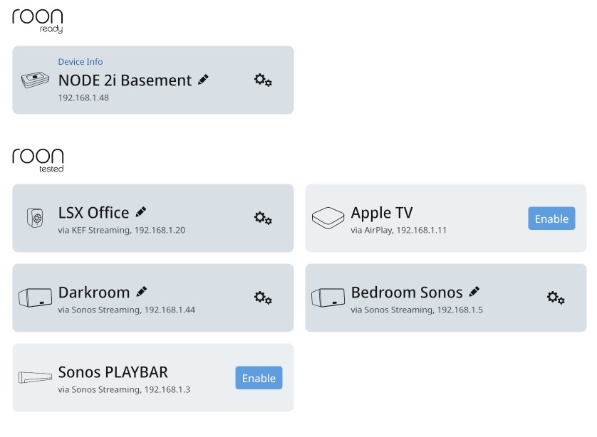
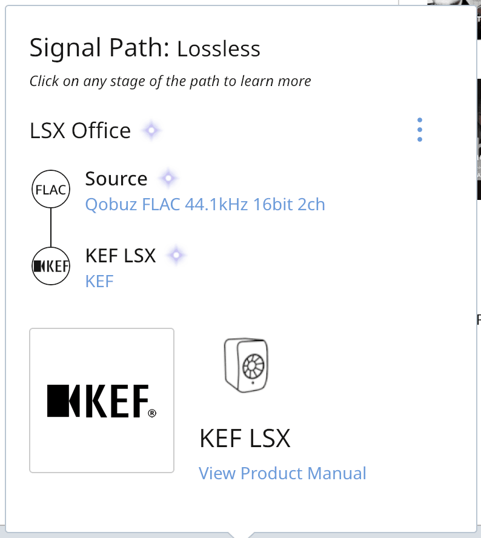

I sit at my home office desk an awful lot these days. This affords me the opportunity to listen to music for long stretches, and I've been taking advantage of that.

One of the best audio purchases I've made recently was a lifetime subscription to [Roon](https://roonlabs.com). Roon does wonderful things with my offline collection of FLAC and MP3 files and at the same time integrates flawlessly with the Hi-Res [Qobuz](https://www.qobuz.com/) streaming service. It's a fantastic way to manage and control my music.

I'd been using a paired set of Apple HomePods on my desk. They sound pretty good, if a little too bass-ey for my taste. HomePods work great with Apple Music, but I no longer use Apple Music. The HomePods offer no alternative inputs or outputs. It's AirPlay or nothing. Unfortunately, Roon doesn't yet support AirPlay 2 so the best way to stream HomePod pair was via AirPlay in Roon from my iPhone. Blech.

This all got me thinking about replacing the HomePods. I used to have a set of [AudioEngine 2+ speakers](https://audioengineusa.com/shop/wirelessspeakers/a2-wireless-computer-speakers/), but I can't seem to find them. Lost in the move? Or maybe I gave them away because I never liked them as much as the many positive reviews made me think I would. I thought they sounded harsh and I would grow fatigued quickly.

So what then? I'm not an audiophile, so I took to the web looking for "quality bookshelf speakers". It took about three minutes to realize that everyone seemed to reference the powered, wireless offerings from [KEF](https://kef.com), and specifically for desktop use, the [KEF LSX Wireless Speaker System](https://us.kef.com/lsx-wireless-music-system.html).

At around $1,200 for the pair, the LSX were twice what I wanted to spend, but I kept reading and watching and learning. I was able to rationalize my way into a pair and am very happy that I did.

Setup wasn't glitch-free, but I think that was due to my mesh Wi-Fi setup. Once I did a factory reset and firmware upgrade of the speakers, all was well and has been since.

Here they are on my desk.

While the LSX aren't officially "Roon Ready", they are "Roon Tested" and show up as such in Roon. 

This is great because it takes full advantage of the Hi-Res stream from Qobuz. Happiness is an all-purple signal path in Roon!

And the sound? All I can say is that in this case the general internet consensus is spot on. They sound amazing. I mean, like really amazing. They are to my left when I'm facing the computer, and several times the past few days I've stopped what I was doing, turned to face the speakers, and replayed a song because I'd heard things in the music that I'd never noticed before. The KEFs have made me literally sit up and take notice. And after many hours of listening to many varieties of music I've not become fatigued at all. Not once. This is huge for me.

For a time I had a single HomePod on the desk and I'm here to tell you that a decent 2-channel setup is in a whole different league than a single HomePod's pseudo stereo. Or Sonos', or Google's, or Echo's. Adding a second stereo-paired HomePod was a huge upgrade, but nothing like what I'm hearing now. I haven't yet gone into the KEF Control app to tweak things to suit the room, which will likely continue to improve the sound.

The KEFs have brought my desktop music streaming experience to an entirely new level and I couldn't recommend them more highly.