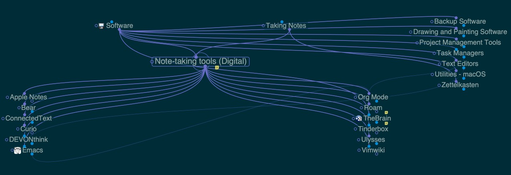
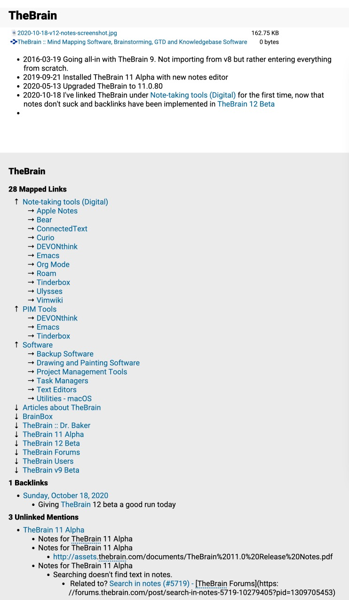

---
categories:
- Software
date: "2020-10-18"
tags:
- Notetaking
- Roam
- TheBrain
title: TheBrain v12 brings Backlinks to the table
---

These days, proper backlinks are becoming table stakes for any respectable note-taking tool.

[Roam Research](https://roamresearch.com) didn't invent backlinks, but their implementation was so well-done and useful that it made other tools seem lacking in comparison. Many of them are now scrambling to catch up.

[TheBrain](https://thebrain.com) is an application that has seriously implemented inter-note linking for many years. The "Plex" is like an infinite mindmap with various types of links and it's amazingly powerful when put to use.

The weakness of TheBrain for me has always been around taking notes. The notes editor always felt janky and looked, to my taste, icky. This has changed dramatically in recent years. Notes became a first-class citizen in version 11 and have really come into their own in the newly-released [Version 12 (beta)](https://www.thebrain.com/blog/version-12-beta).

TheBrain version 12 introduces Backlinks and Mentions, two of Roam's distinguishing features.

I stopped considering TheBrain as my primary repository of notes shortly after Roam was introduced. Roam is all about notes and automatic backlinks. TheBrain was all about structural linking, with notes as an afterthought (that's not entirely fair, but it's how I thought of them).

After a day of testing the new v12 of TheBrain, I'm having second thoughts. Thing is, TheBrain is better than Roam at structural linking. As soon as I activate a "thought" in TheBrain, I immediately get a sense of context. Here's an example:

And a quick screen recording...

<iframe src="https://www.loom.com/embed/37e2b07d6aa74429b822b154c8b930e4" frameborder="0" webkitallowfullscreen mozallowfullscreen allowfullscreen style="position: absolute; top: 0; left: 0; width: 100%; height: 100%;"></iframe>

The big addition in v12 is backlinking. Here's a screenshot the notes in my "thought" for TheBrain...

This shows all of the linked thoughts, and also lists any notes that link to or mention the thought. Very Roam-like! Not only has it become more useful, but the notes area looks really nice and works smoothly now.

I'm going to do some double entry for a week or so to see if these additions to TheBrain work as well as they seem to. I don't know if I'll switch back to TheBrain for the canonical place for my notes, though. Roam has other compelling features that are not (yet) in TheBrain. For example, the effortless creation of "Daily Notes" and block-level referencing are pretty great in Roam and have nothing comperable in TheBrain. 

 It's exciting to see established, tried-and-true tools learn something from a newcomer. Version 12 puts TheBrain back in the game.