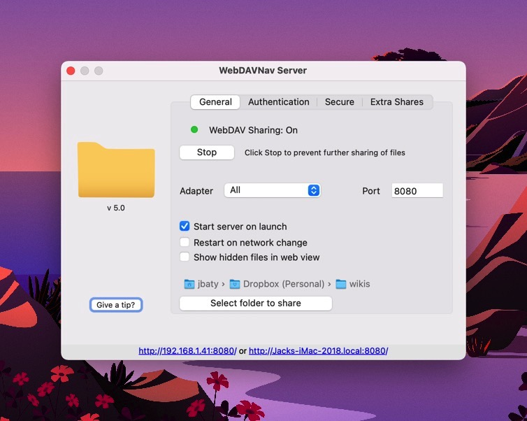

[TiddlyWiki](https://tiddlywiki.com) is an amazing, powerful, flexible, fun bit of software. I use it for various project notes and logs, but mostly I use it for my wiki at [rudimentarylathe.wiki](https://rudimentarylathe.wiki).

I like pretty much everything about TiddlyWiki except the fact that saving the files can be a challenge. A TiddlyWiki is just a simple HTML file. That's it. It's permanent, portable, and about as future-proof as anything. But, making edits in a browser and then saving those changes presents a problem. There are a dozen ways to manage this, but none of them are ideal for me. For Chrome and Firefox, there's the [Timimi browser extension](https://github.com/ibnishak/Timimi). 

Another option is to run the wiki via Node.js. This works in any browser, and can even allow it to run on a server, but it complicates things. It means the wiki is broken up into individual tiddler files and requires installing and running Node/NPM/etc. Separate files may be desirable for some, but I prefer the single-file configuration.

There is an app, [TiddlyDesktop](https://github.com/Jermolene/TiddlyDesktop) that works well, but still requires that I run a separate app just for my wiki.

I just want to run my wiki from a pinned tab in Safari.

Enter WebDAV.

This morning, I stumbled upon [this thread in the TiddlyWiki Google Group](https://groups.google.com/u/1/g/tiddlywiki/c/I_mc1Jycfhc/m/prR0QAppAwAJ). What took me so long and why isn't this a headliner?

Download [WebDAVNav Server app from the Mac App store](https://apps.apple.com/us/app/webdavnav-server/id747482894?mt=12), point it at a folder full of one or more TiddlyWiki HTML files, visit localhost in any browser, and blam!

I keep waiting for the other shoe to drop, because this was just too easy.

- Works in Safari (or any browser, really)
- Super simple setup on my Mac (via the App Store)
- Configuration is a breeze
- I can run as many wikis as I want
- My wiki can remain a single, easily-portable HTML file

Downsides? Well I can't just double-click any old wiki.html file to edit and save. It has to be done through localhost. And it requires running a separate app (the WebDAV server). But, WebDAVNav barely even shows up in Activity Monitor, which is something I couldn't say when I had to run an instance of Firefox or Chrome for editing.

I'll be disappointed if this turns out being too good to be true, but so far it's the best solution I've found for editing and managing TiddlyWikis on my Mac.

